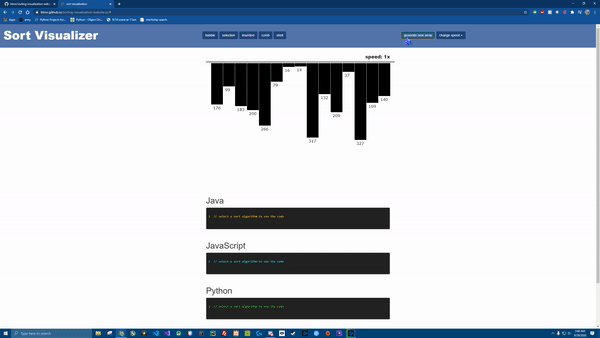

# sorting-visualization-website
A simple webpage that visualizes 5 sorting algorithms (bubble, insertion, selection, comb, and shell) and provides code snippets of them in Java, JavaScript, and Python.

 

Visit the webpage here: https://btror.github.io/sorting-visualization-website.io/
